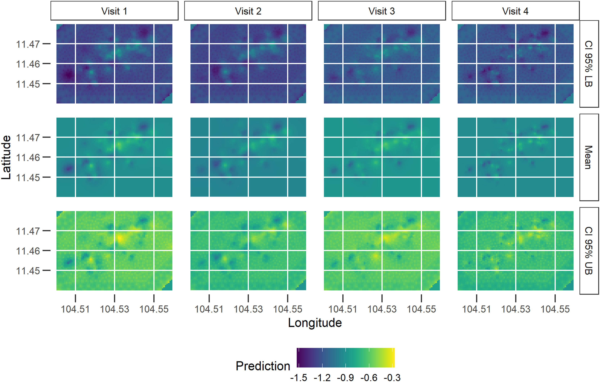
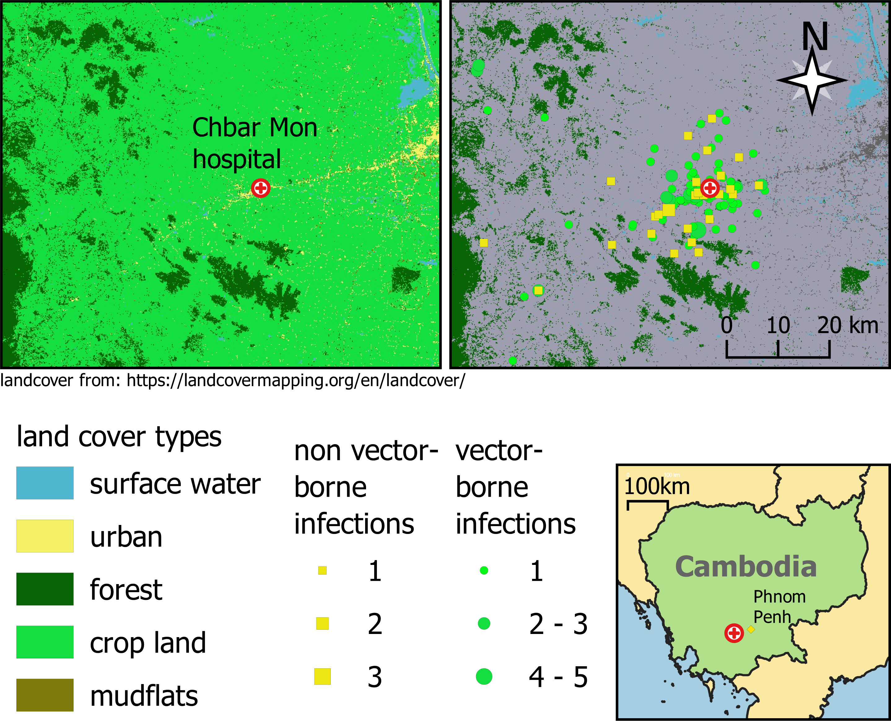
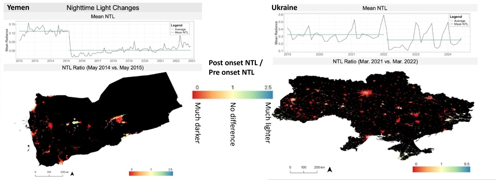

# Earth Observation Hub

**How do we measure things we cannot directly observe?**

That question has followed me through much of my research.

In some ways, this is an ordinary problem in epidemiology. We rarely observe the biological or social processes we care about directly. Even something as seemingly straightforward as determining whether someone has malaria requires a chain of measurement and inference. We might examine a blood smear under a microscope, use a rapid diagnostic test that produces a visible line in response to parasite antigens, or use molecular methods that generate signals from parasite DNA. In each case, we observe something measurable and use it as evidence for something we cannot simply see happening inside a person.

Much of spatial epidemiology works the same way, only at a different scale.

How do people access healthcare? How do they move through landscapes? What environmental conditions do they actually experience? Where are they exposed to pathogens and disease vectors?

These processes are difficult, intermittent, or impossible to observe directly. Much of my research has therefore involved trying to reconstruct them from other kinds of information.

Earth observation is, in one sense, simply taking that logic **sky high**.

I use the term broadly here to include observations of environmental and human systems: satellite imagery, elevation and land-cover data, climate reanalysis, weather stations and field sensors, GPS, mobile-network data, drones, and related forms of measurement. These sources differ enormously in what they observe and how they are collected, but they share a practical purpose in my work: **they allow us to infer conditions, movements, and exposures that we cannot continuously observe on the ground.**

This repository traces how those approaches entered my research, what questions they helped me answer, and where their limitations led to new questions.

> **Definition:** *Earth Observation (EO)* refers to observational data about processes and conditions at or near Earth’s surface. EO spans (a) **environmental sensing** — in-situ gauges and stations (i.e. weather stations), plus **remote sensing** from satellites, aircraft, and drones — and (b) **human-systems sensing** — data on population location or movement such as GPS logger records, mobile-network CDR/handover data, and various forms of telemetry. I treat **Remote Sensing** as a **subset** of EO.

---

## Practical How-To Guides

If you are looking for step-by-step methods rather than the research narrative, see:

- [Earth Observation How-To](https://github.com/parker-group/earth-observation-howto) — practical guides for accessing, processing, and analyzing common Earth observation datasets.

---

## How Earth observation entered my research

The Mahidol–Oxford Tropical Medicine Research Unit ([MORU](https://www.tropmedres.ac/)) network, and especially the Shoklo Malaria Research Unit (SMRU) and Lao–Oxford–Mahosot Hospital–Wellcome Trust Research Unit ([LOMWRU](https://www.tropicalmedicine.ox.ac.uk/research/lao-lomwru-moru-network)), provided me opportunities to integrate Earth observation data into public health.  

Initial work used SRTM elevation data to better understand distances, friction-of-distance, and travel times in malaria research (especially with regard to [METF](https://github.com/DMParker1/METF-mapping)). While at SMRU, I was invited by [Paul Newton](https://www.ndm.ox.ac.uk/team/paul-newton) to give a GIS workshop ([QGIS](https://qgis.org/)) at LOMWRU. This led to collaborations on the spatial epidemiology of infections of the central nervous system in Laos — work that inspired me to explore neglected tropical diseases and environmental predictors of a broad range of health outcomes.

---

## From access and terrain to environmental exposure

Early applications were largely about geography itself: elevation, distance, travel time, and the physical landscapes through which people reached health services. Work with METF and subsequent collaborations in Laos pushed that further, toward questions about how environmental conditions shape the distribution of infectious diseases.

### Landscapes and infectious disease
These collaborations expanded the role of Earth observation in my work from measuring terrain and access to asking how environmental conditions help structure the geography of infectious disease. Elevation, land cover, climate, and other remotely observed features became ways of reconstructing ecological conditions that were difficult to measure directly across large areas.

- **Spatial epidemiology of Japanese encephalitis virus and other infections of the central nervous system in Lao PDR (2003–2011): A retrospective analysis.**  
  Rattanavong S, Dubot-Pérès A, Mayxay M, Vongsouvath M, Lee SJ, Cappelle J, et al. *PLOS Neglected Tropical Diseases*. 2020;14(5):e0008333.  
  https://doi.org/10.1371/journal.pntd.0008333

- **A spatio-temporal analysis of scrub typhus and murine typhus in Laos; implications from changing landscapes and climate.**  
  Roberts T, Parker DM, Bulterys PL, Rattanavong S, Elliott I, Phommasone K, et al. *PLOS Neglected Tropical Diseases*. 2021;15(8):e0009685.  
  https://doi.org/10.1371/journal.pntd.0009685

- **Geographical distribution of *Burkholderia pseudomallei* in soil in Myanmar.**  
  Swe MMM, Win MM, Cohen J, Phyo AP, Lin HN, Soe K, et al. *PLOS Neglected Tropical Diseases*. 2021;15(5):e0009372.  
  https://doi.org/10.1371/journal.pntd.0009372

### From landscapes to exposure
The next step was to move from asking where disease occurs to asking what environmental conditions people and vectors actually experience. This increasingly brought Earth observation into studies of exposure, linking environmental measurements with entomological, epidemiological, and pathogen data.

- **Determinants of exposure to *Aedes* mosquitoes: A comprehensive geospatial analysis in peri-urban Cambodia.**  
  Parker DM, Medina C, Bohl JA, Lon C, Chea S, Lay S, et al. *Acta Tropica*. 2023;239:106829.  
  https://doi.org/10.1016/j.actatropica.2023.106829

  

<b>Figure.</b> Predicted spatial variation in exposure to <i>Aedes</i> mosquitoes across four study visits in peri-urban Cambodia. The rows show the lower 95% credible bound, mean prediction, and upper 95% credible bound. From Parker et al. (2023), <i>Acta Tropica</i>.

- **Spatio-temporal trends of malaria incidence from 2011 to 2017 and environmental predictors of malaria transmission in Myanmar.**  
  Zhao Y, Aung PL, Ruan S, Win KM, Wu Z, Soe TN, et al. *Infectious Diseases of Poverty*. 2023;12:2.  
  https://doi.org/10.1186/s40249-023-01055-6
  
- **Discovering disease-causing pathogens in resource-scarce Southeast Asia using a global metagenomic pathogen monitoring system.**  
  Bohl JA, Lay S, Chea S, Ahyong V, Parker DM, Gallagher S, et al. *Proceedings of the National Academy of Sciences*. 2022;119(11):e2115285119.  
  https://doi.org/10.1073/pnas.2115285119

  

<b>Figure.</b> Land-cover patterns surrounding Chbar Mon Hospital and the geographic distribution of vector-borne and non-vector-borne infections identified through metagenomic pathogen surveillance in Cambodia. From Bohl et al. (2022), <i>Proceedings of the National Academy of Sciences</i>.

### Observing human systems
At the same time, my use of Earth observation broadened beyond environmental sensing. Population movement, displacement, conflict, and settlement patterns also leave measurable traces. Mobile-phone records and other spatial data made it possible to reconstruct aspects of human systems that are no easier to observe continuously than temperature, vegetation, or rainfall.

- **Nighttime lights as a proxy for conflict intensity and infrastructure recovery in Yemen and Ukraine.**  
  Tarnas MC, Vasylyeva TI, Minin VM, Parker DM. *Conflict and Health*. 2026;20:59.  
  [https://doi.org/10.1186/s13031-026-00801-5](https://doi.org/10.1186/s13031-026-00801-5)

  

<b>Figure.</b> Changes in nighttime lights associated with the onset of large-scale conflict in Yemen and Ukraine. Time series show changes in mean nighttime-light radiance, while the maps compare post-onset with pre-onset nighttime lights. Values below 1 indicate areas that became darker, while values above 1 indicate areas that became brighter. Adapted from analyses in Tarnas et al. (2026), <i>Conflict and Health</i>.

  
- **Mobile phone handover data for measuring and analysing human population mobility in Western Ethiopia: implication for malaria disease epidemiology and elimination efforts.** 
  Haileselassie W, Getnet A, Solomon H, Deressa W, Yan G, Parker DM. *Malaria Journal*. 2022;21:323.  
  https://doi.org/10.1186/s12936-022-04337-w

- **Association between air raids and reported incidence of cholera in Yemen, 2016–19: An ecological modelling study.**  
  Tarnas MC, Al-Dheeb N, Zaman MH, Parker DM. *The Lancet Global Health*. 2023;11(12):e1955–e1963.  
  https://doi.org/10.1016/S2214-109X(23)00272-3

- **Ecological study measuring the association between conflict, environmental factors, and annual global cutaneous and mucocutaneous leishmaniasis incidence (2005–2022).**  
  Tarnas MC, Abbara A, Desai AN, Parker DM. *PLOS Neglected Tropical Diseases*. 2024;18(9):e0012549.  
  https://doi.org/10.1371/journal.pntd.0012549

- **A conceptual framework for understanding extractive settlements and disease: Demography, environment, and epidemiology.**  
  Glendening N, Haileselassie W, Parker DM. In: *Planetary health approaches to understand and control vector-borne diseases*. 2024.  
  https://doi.org/10.3920/9789004688650_007

<h2>Featured Case Studies</h2>

  
<strong>Kinshasa EO</strong> — Urban Earth Observation workflows (weather stations + satellite data)

  
<strong>Overview:</strong> <a href="https://github.com/parker-group/Kinshasa_EO/blob/main/docs/OVERVIEW_KinshasaEO.md">Overview of EO data processing</a> 
  <strong>Repository:</strong> <a href="https://github.com/parker-group/Kinshasa_EO">parker-group/Kinshasa_EO</a>

  
<em>What’s inside:</em> end-to-end pipeline for Kinshasa, including weather station extraction, ERA5 time series, MODIS/Landsat indices, QGIS zonal statistics, and R visualizations.

---

## Some of the observation systems used in this work

- [MODIS](https://modis.gsfc.nasa.gov/data/) (NDVI, EVI, surface water indices)  
- [SRTM](https://www.earthdata.nasa.gov/data/instruments/srtm) elevation data  
- [ERA5](https://www.ecmwf.int/en/forecasts/datasets/reanalysis-datasets/era5) climate reanalysis  
- [Landsat](https://landsat.gsfc.nasa.gov/) and [Sentinel](https://sentinels.copernicus.eu/) satellite imagery  
- [GEE](https://earthengine.google.com/) for scalable environmental data extraction  

---

---

## 🔗 Related Repositories

These repositories connect different parts of my spatial epidemiology research:

- [research-trajectory-hub](https://github.com/DMParker1/research-trajectory-hub) — Umbrella repository tying together my career arc.  
- [activity-spaces](https://github.com/DMParker1/activity-spaces) — Research on multi-place exposure (farm huts, GPS, mobile phone data) and its health relevance.  
- [METF-mapping](https://github.com/DMParker1/METF-mapping) — Mapping malaria post placement & community engagement.  
- [tMDA-program](https://github.com/DMParker1/tmda-program) — Targeted mass drug administration trials & modeling.  
- [early-dx-tx](https://github.com/DMParker1/early-dx-tx) — Early access to malaria diagnosis & treatment.  
- [tm-border-mch](https://github.com/DMParker1/tm-border-mch) — Maternal and child health research on the Thailand–Myanmar border.  

---

---

*Maintained by Daniel M. Parker*
