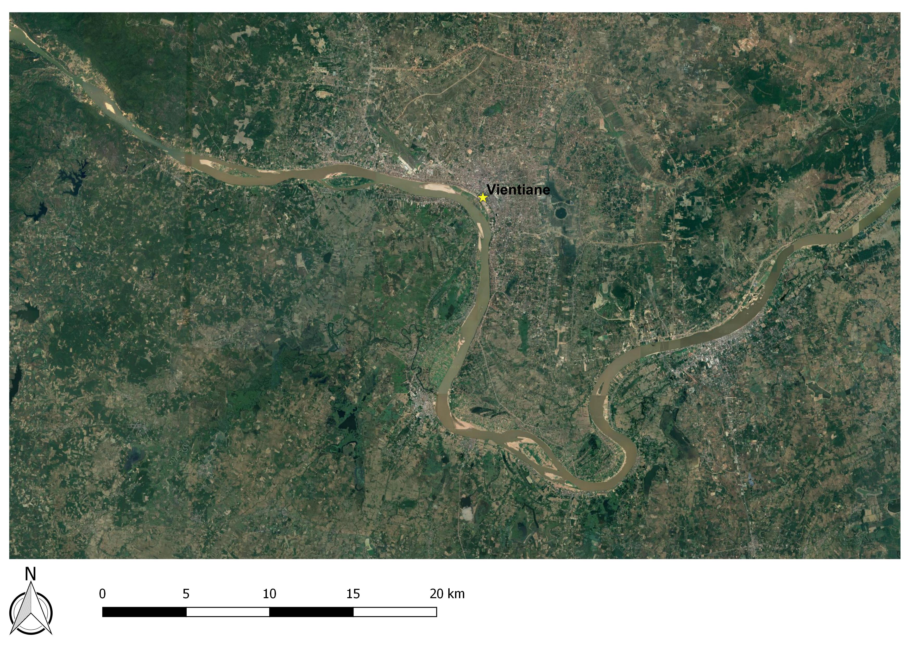
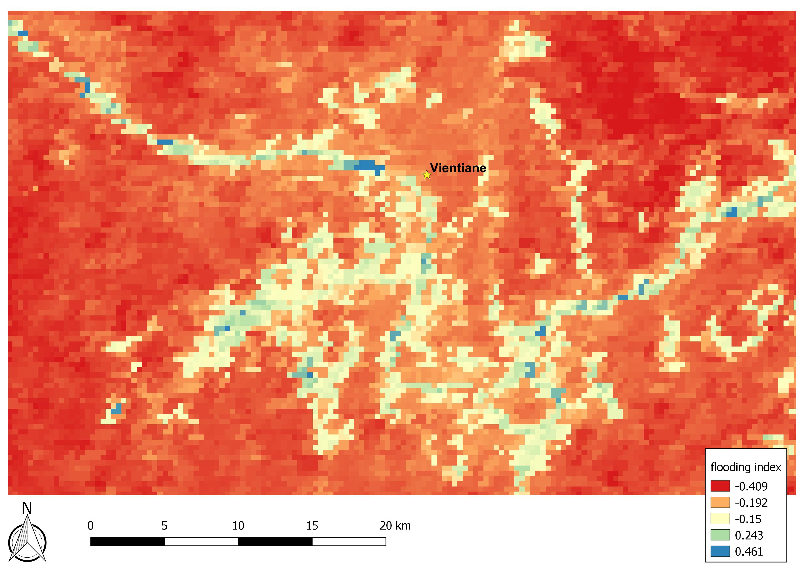
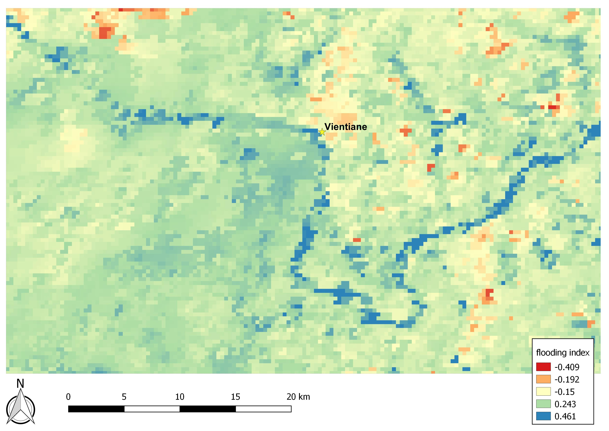

# Reading a landscape from space

One of my early uses of Earth observation in epidemiology came from work on infections of the central nervous system in Laos. We wanted to know whether patients with different infections came from different environmental settings, and whether conditions around their home villages changed in ways that might help explain when and where particular infections occurred.

This required turning satellite observations into epidemiologically useful measurements.

## From an image to an environmental measure

The first image below is a conventional RGB view of the landscape around Vientiane. The Mekong River is readily visible running through the center of the image, even during the dry season.

  

The next two images show a remotely sensed measure sensitive to surface water and moisture over the same landscape, first in February and then in July.

<table>
  <tr>
    <td width="50%" valign="top">
      
       
      <b>February.</b> During the dry season, the Mekong River remains clearly identifiable while much of the surrounding landscape has a relatively low surface-water/moisture signal.
    </td>
    <td width="50%" valign="top">
      
       
      <b>July.</b> During the rainy season, the surface-water/moisture signal extends much more broadly across the surrounding landscape.
    </td>
  </tr>
</table>

The distinction is important. The derived surface is not simply a map of where standing water is visible. At MODIS resolution, each pixel integrates information across a relatively large area, potentially containing combinations of open water, flooded or saturated agricultural land, vegetation, soil, roads, and other surfaces. The resulting index is therefore better interpreted as a relative measure of surface-water and moisture conditions than as a literal inventory of flooded locations.

For epidemiology, however, that measurement can be extremely useful. Satellite observations allow the same environmental characteristic to be measured repeatedly across a large landscape and through time. We can then link those measurements to the locations and timing of human disease.

## What does the satellite see on the ground?

Remote sensing compresses a complicated landscape into pixels and derived measurements. At the 250 m resolution of the MODIS data we were using, a single pixel could contain flooded rice fields, dense vegetation, exposed soil, field boundaries, roads, houses, and other surfaces.

  

<b>Field photograph.</b> Rice-growing landscape near Vientiane, Laos. Standing water is clearly visible in some fields, while adjacent fields contain dense rice vegetation. At MODIS resolution, environmental conditions like these are integrated into measurements representing relatively large areas.

This was not merely an abstract concern. As part of this work, we did ground truthing to better understand how conditions observed in the field corresponded to the remotely sensed measures. Large areas of flooded rice agriculture were relatively easy to identify in the MODIS-derived surface-water signal, while smaller isolated flooded fields were less distinct.

The photograph above illustrates part of the problem. Open water and densely vegetated rice fields occur immediately beside one another, while water can also occur beneath or between vegetation. What looks relatively straightforward while standing in a rice field becomes a mixed spectral signal when observed from space.

The derived measure should therefore not be interpreted as a literal map of standing water. It is better understood as a relative measure of surface-water and moisture conditions at the spatial scale of the satellite data.

Understanding a remotely sensed variable requires moving in both directions: **from the satellite to the ground, and from the ground back to the satellite.**

## From environmental measurement to epidemiology

The goal, however, was not simply to map wet and dry landscapes.

For the Laos studies, patients were linked to their home villages and to the timing of their hospital visits. We could therefore extract remotely sensed environmental conditions around those locations and ask whether people with different infections tended to come from different kinds of landscapes.

This added a temporal dimension as well as a spatial one. Rather than asking only whether a village was generally wet or vegetated, we could ask what environmental conditions looked like around that village during the period immediately preceding a patient's illness.

That distinction matters for infectious-disease ecology. Landscapes are not static. Vegetation changes, agricultural fields flood and dry, rainfall varies, and the ecological conditions supporting vectors and pathogens change through time.

In the Laos work, these remotely sensed measurements helped identify differences in the environmental settings associated with infections including Japanese encephalitis, scrub typhus, and murine typhus.

- Rattanavong S, Dubot-Pérès A, Mayxay M, Vongsouvath M, Lee SJ, Cappelle J, *et al.* (2020). [**Spatial epidemiology of Japanese encephalitis virus and other infections of the central nervous system in Lao PDR (2003–2011): A retrospective analysis.**](https://doi.org/10.1371/journal.pntd.0008333) *PLOS Neglected Tropical Diseases* 14(5):e0008333.

- Roberts T, Parker DM, Bulterys PL, Rattanavong S, Elliott I, Phommasone K, *et al.* (2021). [**A spatio-temporal analysis of scrub typhus and murine typhus in Laos; implications from changing landscapes and climate.**](https://doi.org/10.1371/journal.pntd.0009685) *PLOS Neglected Tropical Diseases* 15(8):e0009685.

## A lesson that carried forward

This work helped shape how I think about Earth observation more generally.

Satellite products make it possible to measure environmental conditions consistently over enormous areas and long periods of time. That is their great strength. But the apparent precision of a raster should not obscure what the measurement actually represents.

A pixel has a spatial scale. An index has a physical and mathematical meaning. Landscapes are heterogeneous; and the environmental conditions relevant to a mosquito, pathogen, or person may occur at scales much finer than the observation system being used.

For me, ground truthing is therefore not separate from Earth observation. It is part of understanding the observation itself.

---

[← Back to the Earth Observation Hub](README.md)
